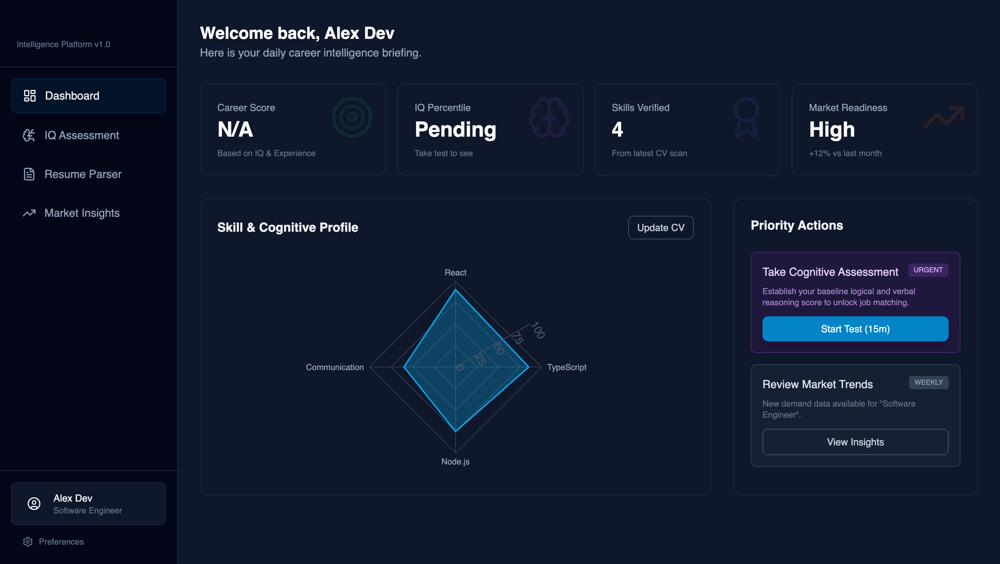

# CareerOracle Intelligence

> A career intelligence platform: cognitive assessment, CV parsing, and live market demand in one profile — so career decisions rest on measured signal rather than self-report.

`TypeScript` · `React` · `Vite` · `Recharts` · `Gemini`

**[Try it live →](https://os-3-ossamamokhtars-projects.vercel.app)**



---

## The problem

Career advice is built almost entirely on self-assessment. People rate their own skills, write their own CV summary, and receive guidance derived from that self-report — which is exactly the input least likely to be accurate about its own blind spots.

CareerOracle inverts the inputs. Cognitive assessment gives a measured baseline, CV parsing extracts what you have actually shipped, and market data supplies what employers are currently paying for. The gap between those three is the useful signal.

## What it does

- **Career score** derived from measured assessment and experience, not a self-rating
- **Cognitive assessment** establishing a logical and verbal reasoning baseline
- **Resume parser** extracting and verifying skills from an uploaded CV
- **Skill & cognitive profile** as a radar chart across hard and soft skills
- **Market insights** showing live demand movement for your role
- **Priority actions** — the next highest-leverage step, not a generic checklist

## Run locally

**Prerequisites:** Node.js 18+

```bash
npm install
cp .env.local.example .env.local    # add your GEMINI_API_KEY
npm run dev
```

## Architecture

Gemini runs **server-side only**. The browser calls `/api/analyze-resume` and `/api/market-insights`; the key never reaches the client, and a build-time check asserts it cannot appear in the bundle.

Those routes deploy as Vercel serverless functions (`api/`) and share one implementation with the local dev server (`server.ts`) via `api/_lib/gemini.ts`, so there is a single source of truth per call.

## Deploying

```bash
vercel                                    # link the project
vercel env add GEMINI_API_KEY production  # server-side only, never exposed
vercel --prod
```

## Status

Working prototype. Dashboard, navigation, and profile visualisation are functional against seeded state; resume parsing and market insights call Gemini and need a key.

**Known issues**
- Tailwind is loaded from the play CDN (`cdn.tailwindcss.com`), which warns against production use. Move to the PostCSS plugin before serious traffic.
- No test coverage yet.

## A note on the repository name

This repo is named `OS3` for historical reasons and was previously described as a note-taking app. Neither matches what it became — the project is CareerOracle Intelligence. The name is kept for now to avoid breaking existing links.

## License

MIT
